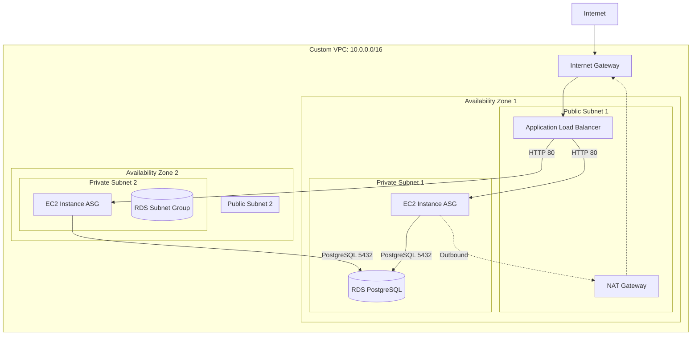

# Scalable Web Application Infrastructure on AWS

## Project Overview

This project provisions a highly available and scalable three-tier web application infrastructure on AWS using Terraform. It demonstrates Infrastructure as Code (IaC) principles by automating the creation of secure and scalable cloud environments.

The architecture includes:
- **Networking Tier:** A custom VPC across two Availability Zones, featuring public and private subnets, an Internet Gateway, and a NAT Gateway for outbound internet access from private resources.
- **Compute Tier:** An Auto Scaling Group of EC2 instances running a simple web server, placed securely within private subnets.
- **Load Balancing Tier:** An Application Load Balancer (ALB) situated in the public subnets to distribute incoming HTTP/HTTPS traffic across the EC2 instances.
- **Database Tier:** A managed Amazon RDS instance (PostgreSQL) located in the private subnets, accessible only from the compute tier.
- **Security:** Strict Security Groups implementing the principle of least privilege.

## Architecture Diagram



## Prerequisites

Before deploying, ensure you have the following installed and configured:
1. **Terraform** (v1.5.0 or later): [Installation Guide](https://developer.hashicorp.com/terraform/downloads)
2. **AWS CLI**: [Installation Guide](https://docs.aws.amazon.com/cli/latest/userguide/getting-started-install.html)
3. **AWS Credentials**: Configure your AWS credentials using `aws configure` so Terraform can authenticate with your AWS account.

## S3 Backend Configuration (State Locking)

This project uses a remote S3 backend with DynamoDB for state locking to support team collaboration and prevent concurrent state modifications. 

1. Create an S3 bucket in your AWS account (e.g., `my-terraform-state-bucket-12345`).
2. Create a DynamoDB table named `terraform-state-lock` with a primary key `LockID` (String).
3. Open `providers.tf` and update the `backend "s3"` block with your bucket and table names.

```hcl
  backend "s3" {
    bucket         = "my-terraform-state-bucket-12345"
    key            = "terraform.tfstate"
    region         = "us-east-1"
    dynamodb_table = "terraform-state-lock"
    encrypt        = true
  }
```

Terraform automatically prefixes state files based on the active workspace (e.g., `env:/dev/terraform.tfstate`).

## Multi-Environment Workspaces

This project uses Terraform Workspaces to manage `dev`, `staging`, and `production` environments from a single codebase. Environment-specific settings (like instance sizes) are defined in `.tfvars` files.

### Deploying Locally

1. **Initialize Terraform:**
   ```bash
   terraform init
   ```

2. **Select or Create a Workspace:**
   ```bash
   terraform workspace select dev || terraform workspace new dev
   ```

3. **Plan Configuration:**
   Pass the corresponding environment variables file to the plan command:
   ```bash
   terraform plan -var-file=dev.tfvars
   ```

4. **Apply Configuration:**
   ```bash
   terraform apply -var-file=dev.tfvars
   ```

## CI/CD Pipeline & Automation

A GitHub Actions pipeline automates the validation, cost estimation, and deployment process.

- **Pull Requests (to `main`):** Automatically runs `terraform fmt`, `terraform validate`, and `terraform plan` against the `staging` workspace. It also uses **Infracost** to post a cost estimation comment on the PR.
- **Merge to `main`:** Automatically applies the infrastructure to the `staging` environment.
- **Production Deployment:** Triggered after the staging deployment, but requires **manual approval** via GitHub Environments (`production`).

To set up the pipeline, ensure the following secrets are added to your GitHub repository:
- `AWS_ACCESS_KEY_ID`
- `AWS_SECRET_ACCESS_KEY`
- `INFRACOST_API_KEY`

## Teardown / Destroy Instructions

When you are done with the infrastructure and want to avoid incurring further AWS charges, destroy all provisioned resources:

```bash
terraform destroy
```

Terraform will compute what needs to be destroyed and prompt for confirmation. Type `yes` to proceed.

---

## Screenshots

> Note: After deploying the infrastructure, place relevant screenshots in the `/screenshots` directory or embed them below to demonstrate successful provisioning.

### 1. VPC Dashboard
*(Placeholder for VPC Dashboard screenshot)*
<!--  -->

### 2. Running EC2 Instances
*(Placeholder for EC2 Instances screenshot)*
<!--  -->

### 3. ALB Listener Rules
*(Placeholder for ALB Listeners screenshot)*
<!--  -->

### 4. RDS Instance Details
*(Placeholder for RDS Details screenshot)*
<!--  -->
