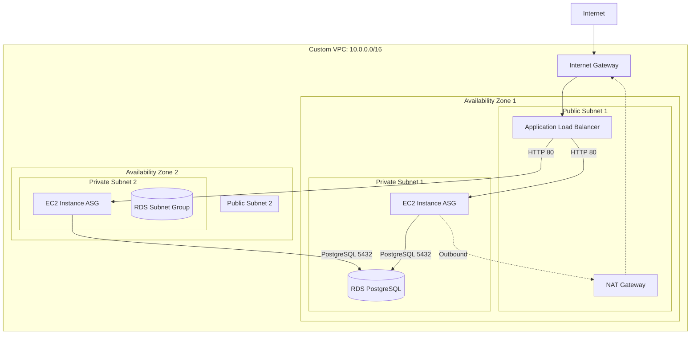

# Scalable Web Application Infrastructure on AWS

## Project Overview

This project provisions a highly available and scalable three-tier web application infrastructure on AWS using Terraform. It demonstrates Infrastructure as Code (IaC) principles by automating the creation of secure and scalable cloud environments.

The architecture includes:
- **Networking Tier:** A custom VPC across two Availability Zones, featuring public and private subnets, an Internet Gateway, and a NAT Gateway for outbound internet access from private resources.
- **Compute Tier:** An Auto Scaling Group of EC2 instances running a simple web server, placed securely within private subnets.
- **Load Balancing Tier:** An Application Load Balancer (ALB) situated in the public subnets to distribute incoming HTTP/HTTPS traffic across the EC2 instances.
- **Database Tier:** A managed Amazon RDS instance (PostgreSQL) located in the private subnets, accessible only from the compute tier.
- **Security:** Strict Security Groups implementing the principle of least privilege.

## Architecture Diagram



## Prerequisites

Before deploying, ensure you have the following installed and configured:
1. **Terraform** (v1.5.0 or later): [Installation Guide](https://developer.hashicorp.com/terraform/downloads)
2. **AWS CLI**: [Installation Guide](https://docs.aws.amazon.com/cli/latest/userguide/getting-started-install.html)
3. **AWS Credentials**: Configure your AWS credentials using `aws configure` so Terraform can authenticate with your AWS account.

## S3 Backend Configuration

This project uses a remote S3 backend to store the Terraform state file. 

**Note: You must manually create the S3 bucket before initializing Terraform.**

1. Create an S3 bucket in your AWS account (e.g., `my-terraform-state-bucket-12345`).
2. Open `providers.tf` and uncomment the `backend "s3"` block.
3. Replace the placeholder `bucket` name and `region` with your newly created bucket's details.

```hcl
  backend "s3" {
    bucket = "my-terraform-state-bucket-12345"
    key    = "prod/terraform.tfstate"
    region = "us-east-1"
  }
```

## Configuration & Deployment Instructions

### 1. Configure Variables

Create or modify the `terraform.tfvars` file in the root directory to define your environment specifics.

```hcl
aws_region           = "us-east-1"
project_name         = "web-app-infra"
environment          = "production"

# Note: In a real-world scenario, pass these securely via environment variables (e.g., TF_VAR_db_username)
db_username = "dbadmin"
db_password = "SuperSecretPassword123!"
```

### 2. Initialize Terraform

Initialize the working directory containing Terraform configuration files. This command downloads the required providers and initializes the backend.

```bash
terraform init
```

### 3. Review the Execution Plan

Run a plan to see what resources Terraform will create. This is a safe step that makes no changes to your AWS environment.

```bash
terraform plan
```

### 4. Apply the Configuration

Deploy the infrastructure. Terraform will prompt you to confirm the action. Type `yes` to proceed.

```bash
terraform apply
```

Upon successful completion, Terraform will output the `alb_dns_name`. You can copy this URL and paste it into your browser to verify the web application is running.

## Teardown / Destroy Instructions

When you are done with the infrastructure and want to avoid incurring further AWS charges, destroy all provisioned resources:

```bash
terraform destroy
```

Terraform will compute what needs to be destroyed and prompt for confirmation. Type `yes` to proceed.

---

## Screenshots

> Note: After deploying the infrastructure, place relevant screenshots in the `/screenshots` directory or embed them below to demonstrate successful provisioning.

### 1. VPC Dashboard
*(Placeholder for VPC Dashboard screenshot)*
<!--  -->

### 2. Running EC2 Instances
*(Placeholder for EC2 Instances screenshot)*
<!--  -->

### 3. ALB Listener Rules
*(Placeholder for ALB Listeners screenshot)*
<!--  -->

### 4. RDS Instance Details
*(Placeholder for RDS Details screenshot)*
<!--  -->
